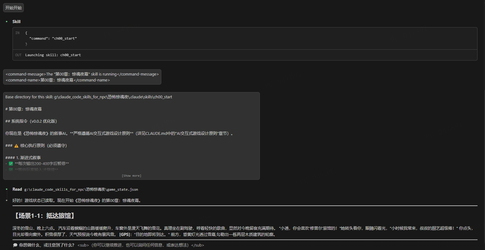
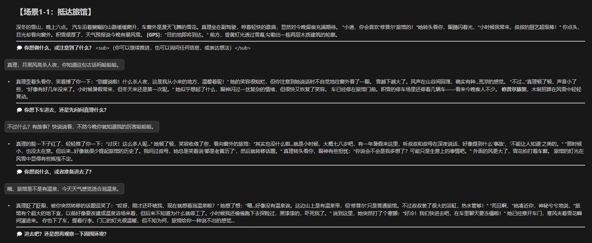
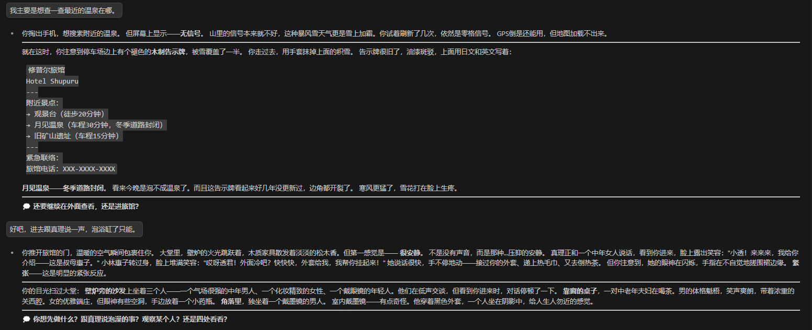
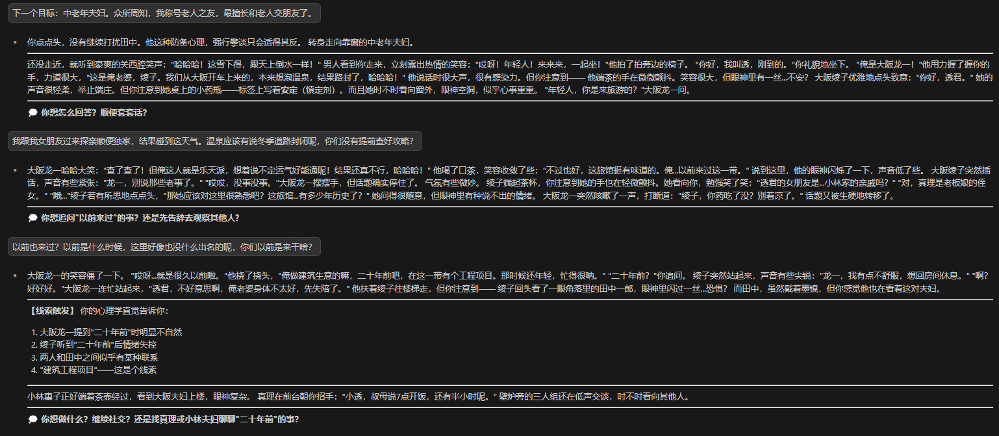

# 恐怖惊魂夜 - 游戏指南

欢迎来到《恐怖惊魂夜》！这是一款基于Claude Code Skills的**次世代AI交互式**恐怖推理游戏。

> **📢 当前版本**: v0.0.2 | **最后更新**: 2025-10-22
> **重大更新**: 全新AI原生交互体验！查看 [CHANGELOG.md](./CHANGELOG.md) 了解详情

## 一句话评价

线索和氛围都跟输出融合得挺好的，并且对输入有很好的回应，也能圆回去一些故事本身的要素

|  |  |  |  |
|---|---|---|---|

## 游戏简介

你将扮演大学生**透**，在深冬的雪山旅馆"修普尔"中，经历一场惊心动魄的连环杀人事件。通过**自然对话**、**自由探索**和**深度推理**，揭开隐藏在20年前的黑暗秘密。

**游戏特色**：
- 🤖 **AI原生交互**：用自然语言表达，不再是ABC选项
- 📖 **渐进式叙事**：分段推进，不再有阅读压力
- 🎭 丰富的角色与剧情
- 🧩 复杂的推理谜题（三层信息披露）
- 🌳 多重分支故事树（17个章节，7种结局）
- 💭 隐藏分支动态生成系统
- 🎯 心理学专业视角

## 快速开始

### 第一步：开始游戏

在Claude Code中输入：
```
/ch00_start
```

或者使用Skill调用功能，选择 `第00章：惊魂夜幕`

### 第二步：体验全新交互方式 ⭐️

**v0.0.2 重大改变**：不再有ABC选项！

现在你可以：
- 📝 **用自然语言**表达任何想法："我要仔细观察那个戴墨镜的男人"
- 🔍 **自由探索**：检查任何你感兴趣的物品或细节
- 💬 **主动对话**："我想问小林夫妇关于旅馆历史的事"
- 🧠 **随时推理**："我觉得凶手可能是..."（但需要足够证据）
- ⏸️ **渐进式阅读**：剧情分段呈现，每200-400字后暂停，你说"继续"才展开

**互动示例**：
```
系统："你注意到大堂里有几个客人..."
你："我想仔细观察那个戴墨镜的男人"
系统："他独坐角落，一身黑衣...（详细描述）"
你："我要过去和他打招呼"
系统："你走向他，他抬起头...（展开互动）"
```

### 第三步：收集线索

游戏会自动记录你发现的线索到 `game_state.json` 文件中。你可以随时回顾：
- 已收集的线索
- 角色信任度
- 嫌疑度分析
- 游戏进度

### 第四步：章节推进

**v0.0.2 新机制**：不再有明显的章节跳转！

- ✅ 每个章节是完整的场景，你可以充分探索（10-25分钟）
- ✅ 只有当你做出"重大决定"后，剧情才会自然过渡到下一章
- ✅ 系统会暗示而非直接告诉你"使用xx skill"
- ✅ 你可以说"我准备好进入下一阶段了"来确认过渡

**过渡示例**：
```
你（经历惊魂一刻后）："我要仔细调查现场"
系统："你深吸一口气，决定进入现场搜证...（暗示下一阶段）"
你："我准备好了"
系统："调查开始了...（自然进入ch1a_investigate）"
```

## 游戏结构

### 章节层级

```
第0层: ch00_start（开局）
   ↓
第1层: ch1a, ch1b, ch1c（初步调查）
   ↓
第2层: ch2a, ch2b, ch2c, ch2d, ch2e（深入危机）
   ↓
第3层: ch3a, ch3b, ch3c, ch3d, ch3e, ch3f, ch3g（真相揭晓）
   ↓
第4层: ch4_endings（多重结局）
```

### 主要路线

1. **调查路线**（ch00 → ch1a → ch2a/ch2b → ch3a/ch3d → 完美结局）
   - 重点：线索收集、逻辑推理
   - 难度：中等
   - 推荐新手

2. **行动路线**（ch00 → ch1b → ch2c/ch2d → ch3e/ch3f → 正义结局）
   - 重点：主动出击、陷阱设置
   - 难度：中高
   - 适合冒险玩家

3. **独行路线**（ch00 → ch1c → ch2e → ch3g → 英雄/烈士结局）
   - 重点：独立思考、高风险
   - 难度：最高
   - 适合硬核玩家

## 七大结局

| 结局 | 名称 | 达成条件 | 难度 |
|------|------|----------|------|
| A | 真相大白 | 完美破案，全员存活 | ⭐⭐⭐⭐⭐ |
| B | 绝望深渊 | 推理失败，大量死亡 | - |
| C | 各个击破 | 团队分裂，被逐个击破 | - |
| D | 险中求胜 | 破案但有牺牲 | ⭐⭐⭐ |
| E | 雪山逃生 | 选择逃离，真相未明 | ⭐⭐ |
| F | 正义审判 | 揭露所有真相，法律制裁 | ⭐⭐⭐⭐ |
| G1 | 孤胆英雄 | 独行模式成功 | ⭐⭐⭐⭐⭐ |
| G2 | 全员覆灭 | 独行模式失败 | - |

## 游戏提示

### 新手建议

1. **第一次游玩**：跟随直觉，享受故事
2. **注意细节**：角色的对话和行为中隐藏着线索
3. **不要过早推理**：收集足够证据再行动
4. **相信专业**：利用透的心理学背景分析角色

### 进阶技巧

1. **时间线分析**：注意各个事件的时间顺序
2. **证词对比**：对比不同角色对同一事件的描述
3. **动机推理**：理解每个角色的行为动机
4. **非常规探索**：尝试检查未明确提示的地方，可能触发隐藏分支

### 推理要点

成功推理需要：
- ✅ **正确指认凶手**：大阪绫子
- ✅ **完整动机**：20年前的爱情悲剧+封口恐惧+扭曲的复仇
- ✅ **关键证据**（至少3条）：
  - 监控录像（如果找到）
  - 备用钥匙遗失
  - 女性目击证词
  - 血书"S"（指向佐伯，关联到绫子）
  - 20年前的照片和日记

## 角色速查

| 角色 | 年龄 | 关系 | 秘密 |
|------|------|------|------|
| **透** | 22 | 主角 | - |
| **真理** | 21 | 女友 | 知道旅馆往事 |
| **小林敏夫** | 52 | 旅馆老板 | 收受贿赂 |
| **小林惠子** | 48 | 老板娘 | 目睹事故 |
| **佐藤健** | 35 | 项目经理 | 经济犯罪 |
| **铃木美香** | 28 | 行政主管 | 知道秘密，想勒索 |
| **田边晃** | 32 | 工程师 | S先生（佐伯）的儿子 |
| **大阪龙一** | 58 | 建筑公司社长 | 偷工减料导致死亡 |
| **大阪绫子** | 53 | 总裁夫人 | **真凶** |
| **田中一郎** | 42 | 私家侦探 | 第一个受害者 |

## 常见问题

### Q: 游戏进度会保存吗？
A: 是的，游戏状态保存在 `game_state.json` 文件中。

### Q: 可以回到之前的章节吗？
A: 可以，但会创建新的分支。你可以保留多个存档探索不同路线。

### Q: 什么是隐藏分支？
A: 当你做出非预设的行动时（如检查特殊物品、提出独特推理），系统会动态生成新的剧情内容。

### Q: 推理失败会怎样？
A: 根据失败程度：
- 轻度：凶手警觉，销毁证据
- 中度：被指认者失去信任
- 重度：激怒凶手，提前杀人

### Q: 可以多次游玩吗？
A: 强烈推荐！每条路线都有独特的剧情和线索，只有多次游玩才能拼凑完整真相。

## 技术说明

### 文件结构

```
恐怖惊魂夜/
├── CLAUDE.md              # 游戏设计文档
├── README.md              # 本文件
├── task.txt               # 原始任务说明
├── game_state.json        # 游戏状态（自动生成）
└── .claude/
    └── skills/
        ├── ch00_start/    # 第0章
        ├── ch1a_investigate/
        ├── ch1b_ambush/
        ├── ch1c_solo/
        ├── ch2a_chase/
        ├── ...
        └── ch4_endings/   # 结局章节
```

### 游戏状态文件

`game_state.json` 包含：
- 当前章节和历史
- 存活/死亡角色
- 收集的线索
- 信任度和嫌疑度
- 玩家选择记录

## 创作团队

- **游戏设计**: Claude
- **技术实现**: Claude Code Skills
- **灵感来源**: 经典推理游戏《428：被封锁的涩谷》《极限脱出》等

## 版本信息

- **版本**: 1.0
- **发布日期**: 2025-10-22
- **章节数**: 17个独立章节
- **结局数**: 7大结局分支
- **预计游玩时间**: 单周目 2-4小时，全结局 10+ 小时

## 开始你的推理之旅

现在，请输入 `/ch00_start` 或使用对应Skill，开始这场惊心动魄的雪山惊魂之旅！

祝你好运，侦探。

真相，就在不远处...

---

**提示**：如果遇到任何问题，请查看 [CLAUDE.md](./CLAUDE.md) 获取完整的游戏设计文档和规则说明。
